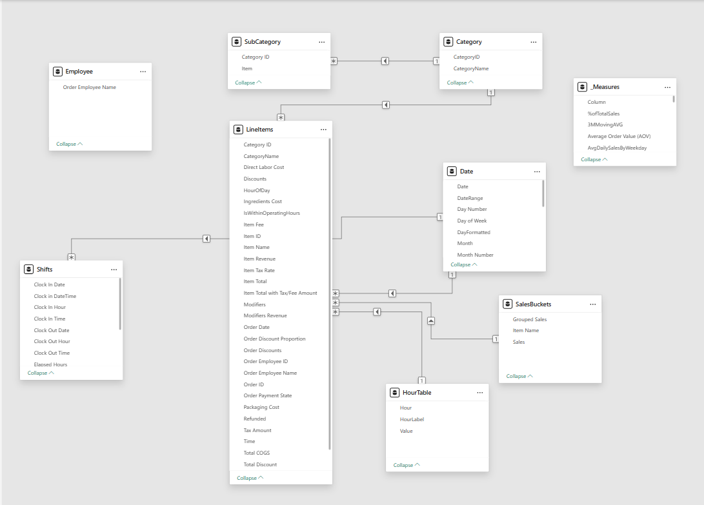

📄 ELT_Process.md
# 🔄 ELT Process: Flour Power Bakery

This document details the Extract, Load, and Transform (ELT) pipeline used to build the Flour Power Bakery sales dashboard in Power BI. The goal was to simulate a realistic POS data flow while ensuring data privacy, model integrity, and report performance.

---

## 🟢 Extract

- **Raw Clover POS exports** were pulled in CSV format:
  - `LineItems.csv`: transaction-level data
  - `Employees.csv`, `Items.csv`, `Categories.csv`: reference tables
  - `Shifts.csv`: shift logs and team schedules
- **Custom-built cost data** (`ItemCosts.xlsx`) included:
  - Direct labor cost by item
  - Ingredient and packaging cost estimates
  - Total calculated COGS
- **Manual mapping** included:
  - Product-to-category assignments
  - Employee-role associations and labels
  - Seasonal periods and date groupings

---

## 🟡 Load

- Imported all files into **Power BI Desktop** using **Power Query**
- Each source was staged in its own query for transparency and future auditability
- Applied data typing and relationship planning during load phase
- Created bridge and dimension tables to ensure flexible relationships across sales, staff, time, and cost

---

## 🔵 Transform

### 🔐 Data Anonymization

- Replaced names of employees and items with GPT-generated fictional values
- Randomized transaction timestamps while preserving granularity
- Fully masked any brand-sensitive terms, customer details, or unique identifiers

### 🧩 Modeling & Mapping

- **Merged `LineItems` with `ItemCosts`** to simulate gross profit and margin
- Added **bridge tables** to join employee shifts and sales items by category
- Calculated surrogate keys to reduce join errors and reinforce one-to-many relationships

### ⏱️ Time Intelligence Setup

- Created a dynamic `Dates` table with:
  - `Season`, `MonthWeekLabel`, and `MonthFormatted`
  - Flags for month boundaries and holidays
- Enabled accurate **MoM**, **YoY**, and **cumulative trend** comparisons using DAX

### 🧼 Cleanup & Enrichment

- Applied 24+ Power Query steps:
  - Deduplication, null handling, conditional logic
  - Reformatting date/times and aligning category labels
  - Ensuring integrity between all foreign key joins

---

## 🧠 Schema Summary

- **Fact Table**: `SalesTransactions` (from LineItems)
- **Dimension Tables**: `Employees`, `Items`, `Categories`, `Shifts`, `Dates`, `ItemCosts`
- **Bridge Tables**: Connect employee roles, item categories, and shift logic

---
## 👁️ Visual Schema Overview

Below is the star schema used in this project, as designed in Power BI Desktop:

_Star schema for Flour Power Bakery sales analysis, illustrating the fact table and connected dimension tables._
*For additional context on the project’s visuals, KPIs, and storytelling, see the main [README.md](./README.md).*  



This file gives your technical process a home of its own, while keeping your main README clean and presentation-ready. Just add it to your GitHub repo and link it wherever you like. Let me know if you'd like a matching header image or a visual schema sketch down the line! 📈🧱✨
