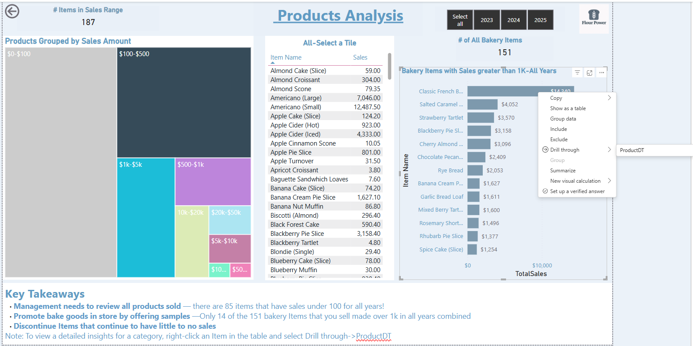
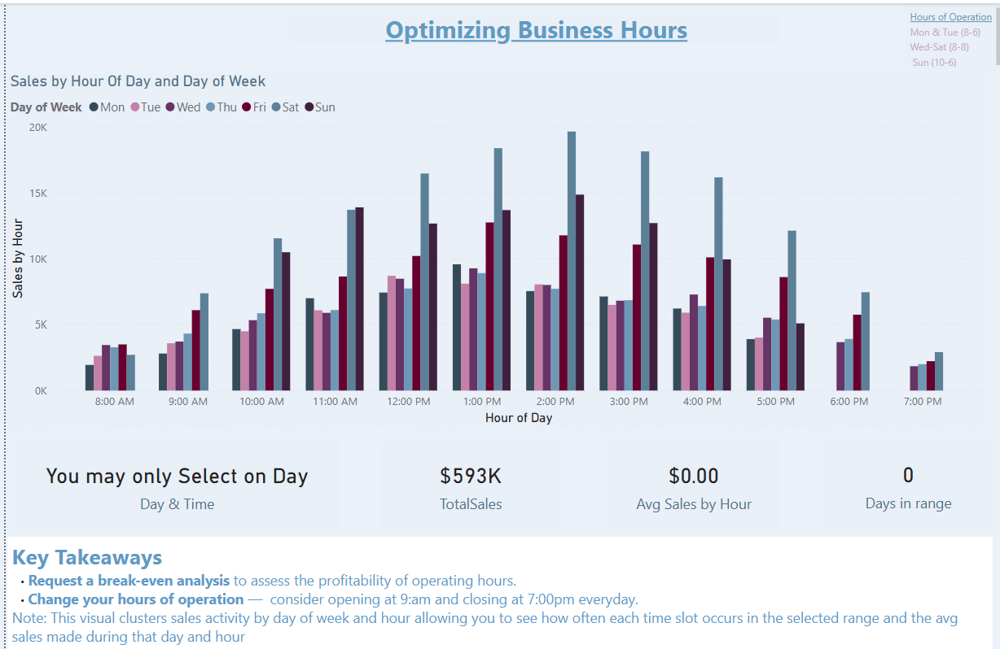

# 🧁 Flour Power Bakery Power BI Report

This interactive Power BI report is built for the **retail industry**, using synthetic POS-style data to analyze sales, product performance, and customer trends for a fictional bakery chain, Flour Power.

---

## 📊 Report Overview

- **Purpose**: Visualize product performance, lost revenue, and daily sales dynamics
- **Data Source**: Simulated multi-location point-of-sale data modeled with fact/dim tables
- **Pages**:
  1. **Staffing Based on Sales** – Day of week sales vs. Employee hours
  2. **Product Performance w/Drill through** – Item profitabiity and COGS modeling
  3. **Optimizing Business Hours** – Hourly revenue by hour and day of week

---

## 🎬 Report Walkthrough Videos

Each thumbnail links to a focused YouTube demo:

  
[📎 _Staffing optimization through daily sales pacing_]

  
[📎 _Lost revenue and high-margin item analysis_]

  
[📎 _Aligning open hours with peak customer traffic_]

---

## 📄 Project Documentation

- [🔄 FlourPower ELT Process](./FlourPowerELT_Process.md) – Data cleaning, transformation, and schema modeling
- [🧮 FlourPower DAX Logic](./FlourPowerDAX.md) – KPI formulas, margin calculations, and time intelligence patterns

---

## ⚙️ Key Features

- Optimize buiness hours w/year, month & month week sclicers 
- Daily sales DAX with custom COGS logic  
- Buckets items by sales to highlight underperforming products  
- Retail-friendly layout with accessible visuals and labeled KPIs

---

## 🧠 Technologies Used

- Power BI Desktop  
- DAX (Data Analysis Expressions)  
- Page navigation & slicer-based filtering 
- Power Query for merging mapped tables & general cleaning  
- YouTube for hosted walkthroughs
